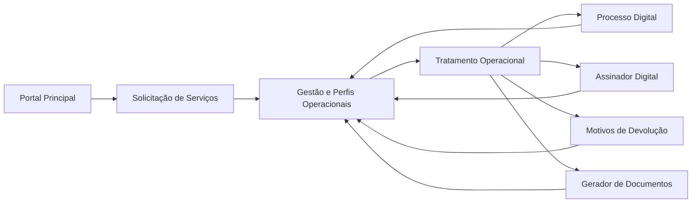

# Fluxo de Negócio Desejado

Este artefato descreve o fluxo de negócio desejado do ecossistema SILIC 2.0. Ele não representa a arquitetura comprovada em código; representa a organização funcional pretendida para a jornada do usuário e da operação.

## Objetivo

Separar explicitamente:

- a arquitetura real verificada no código;
- o fluxo funcional desejado para o produto;
- as lacunas que ainda precisam ser transformadas em integração técnica real.

## Premissas

- O Portal Principal continua como ponto de entrada da jornada.
- Deve existir um módulo claro de solicitação de serviços, distinto dos módulos de gestão operacional e de apoio especializado.
- A fila operacional e os perfis de trabalho devem concentrar priorização, distribuição e acompanhamento.
- Módulos especializados devem ser acionados conforme o estágio e o tipo da demanda, sem fragmentar a jornada do usuário.

## Fluxo Desejado

## Leitura do Fluxo

1. O usuário entra pelo Portal Principal.
2. A demanda nasce em Solicitação de Serviços, com contexto mínimo suficiente para triagem e acompanhamento.
3. A demanda é encaminhada para Gestão e Perfis Operacionais, onde ocorre classificação, priorização, distribuição e controle.
4. O Tratamento Operacional executa a demanda e aciona módulos especializados conforme necessidade.
5. Os resultados retornam ao núcleo de gestão para consolidação, registro, nova decisão ou encerramento.

## Capacidades Esperadas por Etapa

| Etapa | Capacidade desejada |
| --- | --- |
| Portal Principal | Entrada unificada, navegação, visão resumida da jornada e atalhos por perfil |
| Solicitação de Serviços | Abertura da demanda, tipificação, anexos, contexto inicial e protocolo |
| Gestão e Perfis Operacionais | Fila, distribuição, SLA, filtros, favoritos, pendências, histórico e governança operacional |
| Tratamento Operacional | Execução do trabalho, atualização de status e decisão de encaminhamento |
| Processo Digital | Tramitação processual e formalização digital de etapas |
| Assinador Digital | Assinatura eletrônica dos documentos exigidos |
| Motivos de Devolução | Catálogo padronizado de inconsistências, devoluções e justificativas |
| Gerador de Documentos | Montagem e emissão de minutas, editais e artefatos formais |

## Lacunas Entre Desejo e Código Atual

- O módulo de Solicitação de Serviços ainda não está claramente comprovado em um repositório específico do workspace.
- As integrações entre gestão, operação e módulos especializados ainda aparecem mais como intenção documental do que como contratos técnicos efetivos.
- Persistência, eventos, APIs e estados compartilhados ainda estão dispersos e, em vários pontos, restritos a `localStorage` ou arquivos locais.
- O retorno dos módulos ao núcleo da jornada ainda ocorre mais por navegação do que por sincronização sistêmica.

## Uso Recomendado

- Usar este documento para alinhamento de produto, arquitetura alvo e priorização.
- Usar `architecture/ecosystem-map.md` como referência da arquitetura comprovada.
- Revisar este fluxo sempre que uma hipótese virar integração real em código.