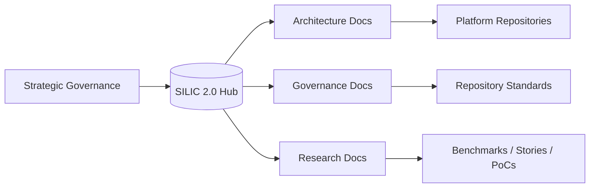

# Architecture Context Diagram (Mermaid Example)

```mermaid
flowchart LR
    Strategy[Strategic Governance] --> Docs[(SILIC 2.0 Hub)]
    Docs --> Arch[Architecture Docs]
    Docs --> Gov[Governance Docs]
    Docs --> Res[Research Docs]

    Arch --> Platform[Platform Repositories]
    Gov --> Standards[Repository Standards]
    Res --> Insights[Benchmarks / Stories / PoCs]
```
