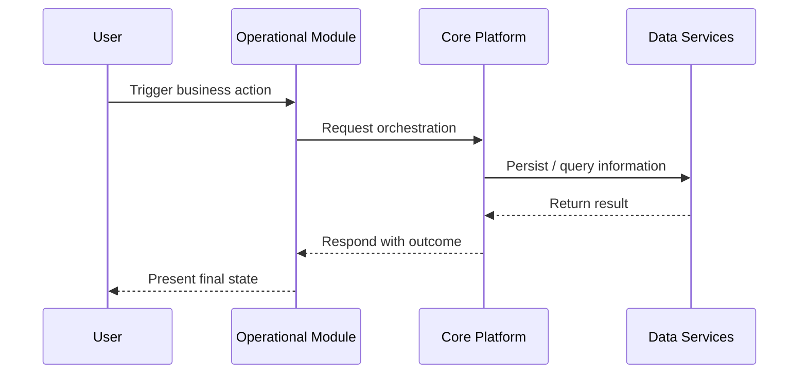

# Module Interaction Diagram (Mermaid Example)

```mermaid
sequenceDiagram
    participant User
    participant App as Operational Module
    participant Core as Core Platform
    participant Data as Data Services

    User->>App: Trigger business action
    App->>Core: Request orchestration
    Core->>Data: Persist / query information
    Data-->>Core: Return result
    Core-->>App: Respond with outcome
    App-->>User: Present final state
```
