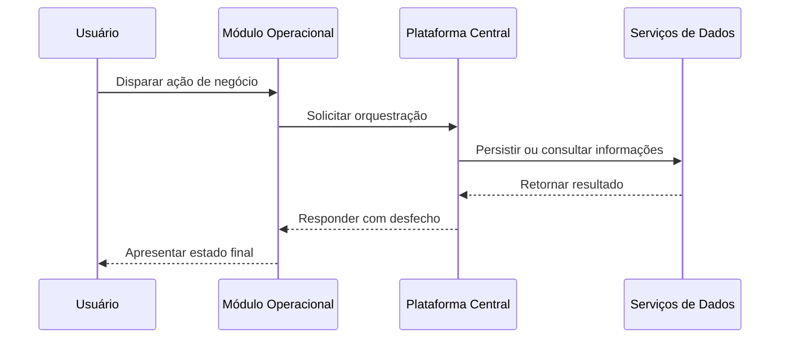

# Diagrama de Interação entre Módulos (Exemplo em Mermaid)

```mermaid
sequenceDiagram
    participant Usuario as Usuário
    participant Modulo as Módulo Operacional
    participant Plataforma as Plataforma Central
    participant Dados as Serviços de Dados

    Usuario->>Modulo: Disparar ação de negócio
    Modulo->>Plataforma: Solicitar orquestração
    Plataforma->>Dados: Persistir ou consultar informações
    Dados-->>Plataforma: Retornar resultado
    Plataforma-->>Modulo: Responder com desfecho
    Modulo-->>Usuario: Apresentar estado final
```
