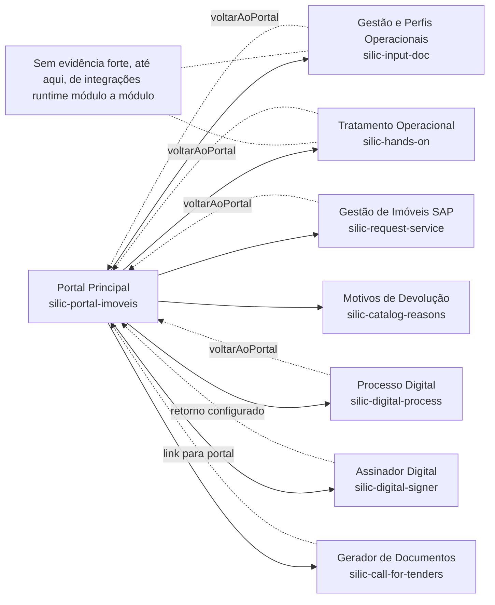

# Diagrama de Contexto do Sistema

Este documento representa visualmente como os módulos do ecossistema SILIC 2.0 se conectam com base nas evidências reais encontradas no código-fonte disponível.

## Leitura do Diagrama

- O padrão dominante confirmado no código é `portal -> módulos satélite`, por navegação direta entre URLs publicadas.
- Vários módulos também implementam caminho explícito de retorno ao portal.
- O nó de `silic-request-service` foi relabelado para o papel realmente sustentado pelo código: um protótipo legado de gestão de imóveis com dados SAP e locadores.
- O diagrama não afirma integrações técnicas diretas entre os módulos satélite, porque elas ainda não foram comprovadas no código revisado.

## Uso Recomendado

- Utilizar este diagrama como referência visual de alto nível.
- Usar `architecture/fluxo-negocio-desejado.md` quando a discussão for sobre jornada alvo de negócio, e não sobre arquitetura comprovada.
- Manter diagramas derivados separados para distinguir fluxo desejado de negócio e arquitetura comprovada em código.
- Refinar este diagrama quando surgirem contratos, APIs e eventos formalizados entre os módulos.
